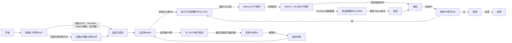

```mermaid
graph LR
    A[开始] --> B[初始化子程序INIT]
    B -->|初始化R5、74LS595、TABLE偏移、定时器0| C[返回主程序]
    C --> D[主程序MAIN]
    D -->|初始化R0和R4| E[进入行扫描循环ROW_ROL]
    E -->|更新LED显示| F[MatrixLED子程序]
    F -->|短暂延时| G[WRITE_74LS595子程序]
    G -->|提供短暂延时| H[返回]
    H -->|递减R0| I[检查R0是否为0]
    I -->|是| E
    I -->|否| J[结束]
    B -->|设置全局中断允许| K[设置定时器0中断允许]
    K --> C
    D -->|定时器0中断| L[T0_INT中断子程序]
    L -->|重新加载定时器初值| M[更新R5和R1]
    M -->|重置R1| N[退出中断]
    N --> D
    G -->|从TABLE读取数据| O[发送数据到74LS595]
    O -->|更新TABLE索引| P[返回]
    P --> H
    J -->|结束| Q[结束]
```